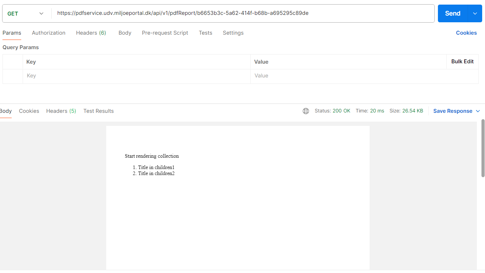
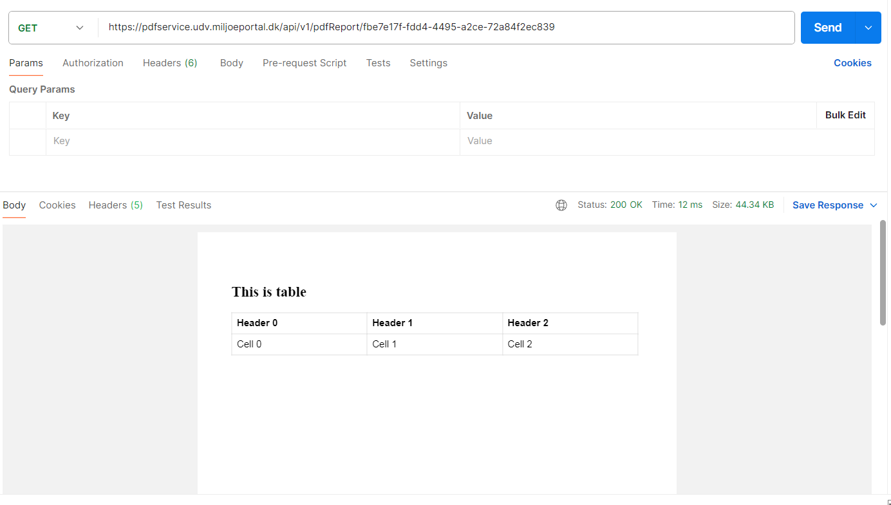

# Complex Merge Fields Documentation
This section organizes more complex merge fields into nested objects, supporting both structured data and hierarchical relationships.

## Contents
1. [Simple Collection](#simple-collection)
2. [Two Levels Collection](#two-levels-collection)
3. [Multi-Level Collections](#multi-level-collections)
4. [Use Table](#use-table)

## 1. Simple Collection

The Simple Collection section is designed to store grouped or hierarchical data, facilitating the organization and representation of complex, nested content. This structure supports scenarios where a collection of items or objects needs to be iteratively rendered within a template, allowing for dynamic content generation.

### Purpose

Stores grouped or hierarchical data that can be represented as collections.

### Structure

- **Key**: Represents the identifier for the collection or variable (e.g., `CollectionItems`). The key is used within the template to access the collection’s data.
- **Type**: Set to `"Collection"`, indicating that this field contains a collection of items or objects.
- **Value**: Can either be a list of simple merge fields (e.g., text-based properties) or `null`. Typically used to store properties of the collection itself.
- **Children**: A list of items or objects that belong to the collection. Each child item can have its own key, type, value, and nested properties.

### Example

- HTML template: [here](../simpleCollection.html)

- Payload for Collection:

  ```
  [
    {
      "Key": "simpleCollection",
      "Type": "Collection",
      "Value": [
        {
          "Key": "Title",
          "Type": "Text",
          "Value": "Start rendering collection"
        }
      ],
      "Children": [
        {  
          "Value": [
            {
              "Key": "Title",
              "Value": "Title in children1",
              "Type": "text"
            }
          ]
        },
        { 
          "Value": [
            {
              "Key": "Title",
              "Value": "Title in children2",
              "Type": "text"
            }
          ]
        }
      ]
    }
  ]
  ```

### Result:


In this example, the template includes a placeholder for iterating through the collection {$simpleCollection}. The collection has a title and contains child items, each with its own title that can be rendered within the list.

## 2. Two Levels Collection

The Two Levels Collection structure is used for representing hierarchical data with multiple nested levels. This structure supports collections that contain child collections, enabling the creation of templates with complex data relationships, such as parent-child hierarchies.

### Structure

- **Key**: Identifies the collection (e.g., `twoLevelCollection`). This key is used in the template to reference the collection.
- **Type**: Set to `"Collection"`, indicating that this element is a group of items or sub-collections.
- **Value**: Contains properties of the collection itself, typically as a list of simple merge fields.
- **Children**: A list of nested items or sub-collections. Each child can contain its own key, type, value, and additional nested properties.

### Example

- HTML Template: [here](../twoLevelCollection.html)

  _The template uses placeholders to loop through the CollectionItems collection and display its child collections. It also iterates through the nested children within each child collection._

- JSON Payload for Collection:
  ```
  [
    {
      "Key": "twoLevelCollection", 
      "Value": [
        {
          "Key": "Title",
          "Type": "Text",
          "Value": "Start rendering collection"
        }
      ],
      "Children": [
        {  
          "Value": [
            {
              "Key": "Title",
              "Value": "Title in children1",
              "Type": "text"
            }
          ],
          "Children": [
            {  
              "Value": [
                {
                  "Key": "Title",
                  "Value": "Item 1 in chidren 1",
                  "Type": "text"
                }
              ]
            },
            {  
              "Value": [
                {
                  "Key": "Title",
                  "Value": "Item 2 in chidren 1",
                  "Type": "text"
                }
              ]
            }
          ]
        },
        {  
          "Value": [
            {
              "Key": "Title",
              "Value": "Title in children2",
              "Type": "text"
            }
          ],
          "Children": [
            {  
              "Value": [
                {
                  "Key": "Title",
                  "Value": "Item 1 in chidren 2",
                  "Type": "text"
                }
              ]
            },
            {  
              "Value": [
                {
                  "Key": "Title",
                  "Value": "Item 2 in chidren 2",
                  "Type": "text"
                }
              ]
            }
          ]
        }
      ]
    }
  ]
  ```

**Result:**

In this example, the template is set up to iterate through a collection that contains nested child collections. The first level renders the main collection (CollectionItems) and its children, while the second level renders the children of those child items.

## 3. Multi-Level Collections
The structure described above is not limited to just two levels of nesting. You can extend it to multiple levels, allowing for deeper hierarchies and more complex data relationships.

**How It Works:**
Each collection can have its own children, and those children can themselves be collections with further nested children. This recursive pattern enables you to create an unlimited depth of nested structures.

## 4. Use table 
The Use Table structure allows for the creation of tabular data representations within a template. This setup is particularly useful for scenarios where content needs to be displayed in rows and columns, such as in reports, data grids, or structured listings.
**Structure:**
- Key: The identifier for the collection (e.g., CollectionItems), used to access and render the table data.
- Type: Set to "Collection", indicating that this field contains a group of items representing the table structure.
- Value: Contains properties of the table, such as its title.
- Children: A list of items that represent rows, columns, and cells within the table. Each child can have its own key, type, value, and nested properties.

**Example:**
- HTML template: [here](../collectionWithTable.html)

- Payload for Collection: 

  ```
  [
    {
      "Key": "collectionWithTable",
      "Type": "Collection",
      "Value": [
        {
          "Key": "Title",
          "Type": "Text",
          "Value": "This is table"
        }
      ],
      "Children": [
        {
          "Key": "children01",
          "Type": "collection",
          "Value": null,
          "Header": [
            {
              "Key": "header0",
              "Value": "Header 0",
              "Type": "text"
            },
            {
              "Key": "header1",
              "Value": "Header 1",
              "Type": "text"
            },
            {
              "Key": "header2",
              "Value": "Header 2",
              "Type": "text"
            }
          ],
          "Children": [
            {
              "Value": null,
              "Children": [
                {
                  "Value": [
                    {
                      "Key": "Data",
                      "Value": "Cell 0",
                      "Type": "text"
                    }
                  ]
                },
                {
                  "Value": [
                    {
                      "Key": "Data",
                      "Value": "Cell 1",
                      "Type": "text"
                    }
                  ]
                },
                {
                  "Value": [
                    {
                      "Key": "Data",
                      "Value": "Cell 2",
                      "Type": "text"
                    }
                  ]
                }
              ]
            }
          ]
        }
      ]
    }
  ]
  ```
**Result**

**In this example:**

The template uses placeholders to render a table with headers and data rows.
The payload includes a main collection (CollectionItems) that contains a title, header information, and nested collections representing rows and cells.
**Key Highlights:**
- Dynamic Headers: The header row is generated based on the Header collection within each child, allowing for customizable column names.
- Nested Data Rows: Rows and cells are defined using nested collections, making the structure flexible for complex table designs.
- Scalability: This approach supports tables of any size, with unlimited rows and columns, by simply adjusting the payload structure.