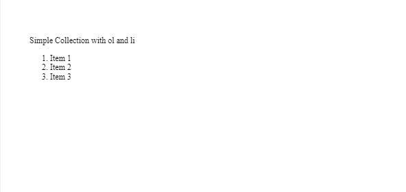
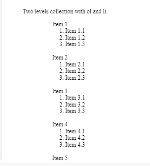
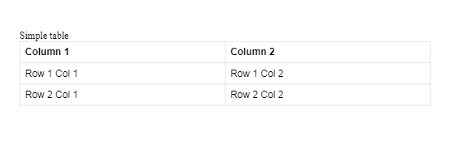

# Complex Merge Fields Documentation

This section organizes more complex merge fields into nested objects, supporting both structured data and hierarchical relationships.

## Contents

- [Complex Merge Fields Documentation](#complex-merge-fields-documentation)
  - [Contents](#contents)
  - [1. Simple Collection](#1-simple-collection)
    - [Purpose](#purpose)
    - [Example](#example)
    - [Result:](#result)
  - [2. Two Levels Collection](#2-two-levels-collection)
    - [Example](#example-1)
  - [3. Multi-Level Collections](#3-multi-level-collections)
  - [4. Use table](#4-use-table)

## 1. Simple Collection

The Simple Collection section is designed to store grouped or hierarchical data, facilitating the organization and representation of complex, nested content. This structure supports scenarios where a collection of items or objects needs to be iteratively rendered within a template, allowing for dynamic content generation.

### Purpose

Stores grouped or hierarchical data that can be represented as collections.

### Example

- HTML template: [here](../simpleCollection.html)

- Payload for Collection:

  ```
  {
  "items": [{ "name": "Item 1" }, { "name": "Item 2" }, { "name": "Item 3" }]
  }

  ```

### Result:



In this example, the template includes a placeholder for iterating through the collection {{simpleCollection}}. The collection has a title and contains child items, each with its own title that can be rendered within the list.

## 2. Two Levels Collection

The Two Levels Collection structure is used for representing hierarchical data with multiple nested levels. This structure supports collections that contain child collections, enabling the creation of templates with complex data relationships, such as parent-child hierarchies.

### Example

- HTML Template: [here](../twoLevelCollection.html)

- JSON Payload for Collection:

  ```
  {
  "items": [
    {
      "name": "Item 1",
      "subItems": [
        { "name": "Item 1.1" },
        { "name": "Item 1.2" },
        { "name": "Item 1.3" }
      ]
    },
    {
      "name": "Item 2",
      "subItems": [
        { "name": "Item 2.1" },
        { "name": "Item 2.2" },
        { "name": "Item 2.3" }
      ]
    },
    {
      "name": "Item 3",
      "subItems": [
        { "name": "Item 3.1" },
        { "name": "Item 3.2" },
        { "name": "Item 3.3" }
      ]
    },
    {
      "name": "Item 4",
      "subItems": [
        { "name": "Item 4.1" },
        { "name": "Item 4.2" },
        { "name": "Item 4.3" }
      ]
    },
    {
      "name": "Item 5",
      "subItems": [
        { "name": "Item 5.1" },
        { "name": "Item 5.2" },
        { "name": "Item 5.3" }
      ]
    }
  ]
  }

  ```

**Result:**

In this example, the template is set up to iterate through a collection that contains nested child collections. The first level renders the main collection (CollectionItems) and its children, while the second level renders the children of those child items.

## 3. Multi-Level Collections

The structure described above is not limited to just two levels of nesting. You can extend it to multiple levels, allowing for deeper hierarchies and more complex data relationships.

**How It Works:**
Each collection can have its own children, and those children can themselves be collections with further nested children. This recursive pattern enables you to create an unlimited depth of nested structures.

## 4. Use table

The Use Table structure allows for the creation of tabular data representations within a template. This setup is particularly useful for scenarios where content needs to be displayed in rows and columns, such as in reports, data grids, or structured listings.
**Structure:**

- header: Defines column headers with "label" (display name) and "key" (used in data rows).
- data: Contains rows where each object represents a row with key-value pairs matching the header keys.
- Purpose: Enables dynamic table generation, separation of concerns, and scalability for adding more columns and rows easily.
  **Example:**

- HTML template: [here](../simpletable.html)

- Payload for Collection:

  ```
  {
  "table": {
    "header": [
      { "label": "Column 1", "key": "col1" },
      { "label": "Column 2", "key": "col2" }
    ],
    "data": [
      { "col1": "Row 1 Col 1", "col2": "Row 1 Col 2" },
      { "col1": "Row 2 Col 1", "col2": "Row 2 Col 2" }
    ]
  }
  }
  ```

  **Result**
  
  **In this example:**
  The payload includes a main collection (CollectionItems) that contains a title, header information, and nested collections representing rows and cells.
  **Key Highlights:**

- Dynamic Headers: The header row is generated based on the Header collection allowing for customizable column names.
- Nested Data Rows: Rows and cells are defined using nested collections, making the structure flexible for complex table designs.
- Scalability: This approach supports tables of any size, with unlimited rows and columns, by simply adjusting the payload structure.
