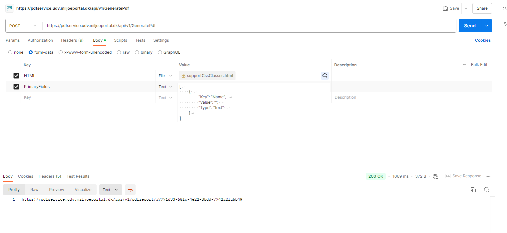
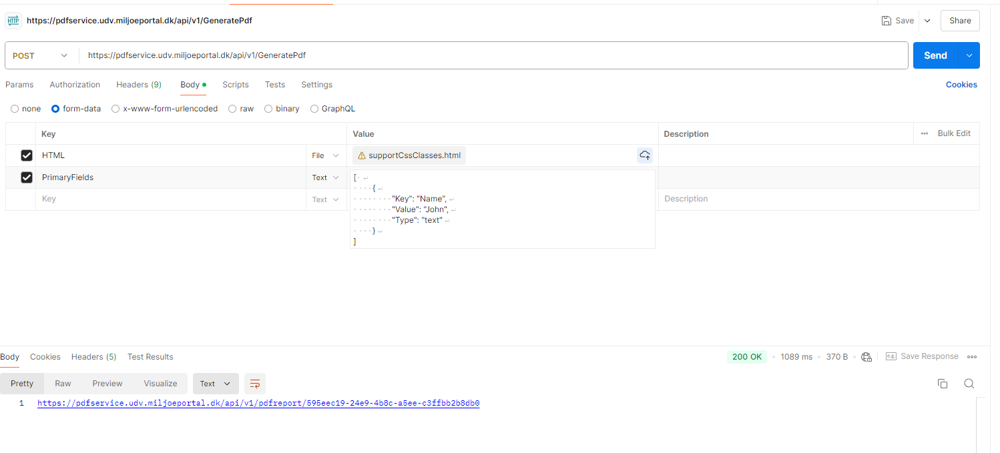

# Visibility Control with `hidden-paragraph` and `validate-rule` Classes

This implementation involves two classes that determine whether a section should be displayed based on the content inside a child element.

## HTML Structure

```html
<div class="hidden-paragraph">
      <span>My name is:  </span>
      <span class="validate-rule">{$Name}</span>
</div>
```

## Example

**HTML Template:** [here](../supportCssClasses.html)

**Payload:** To control the visibility of the hidden-paragraph section, use the PrimaryFields array in your payload.
- To hide the section:

```json
[
    { 
        "Key": "Name", 
        "Value": "", 
        "Type": "text" 
    }
]
```
In this case, if the `Name` value is empty, the entire section with the hidden-paragraph class will be hidden.


- To show the section:
```json
[ 
    {
        "Key": "Name",
        "Value": "John",
        "Type": "text"
    }
]
```
When a non-empty value (e.g., "John") is provided for the Name, the section will be displayed as normal.



## Explanation
- `hidden-paragraph`: This parent class controls the visibility of the entire section. It determines whether the section should be shown or hidden based on the content inside its child elements.

- `validate-rule`: This child class contains dynamic content, such as `{$Name}`. If this content is empty or not present, the entire section (i.e., the element with the `hidden-paragraph` class) should be hidden from view.