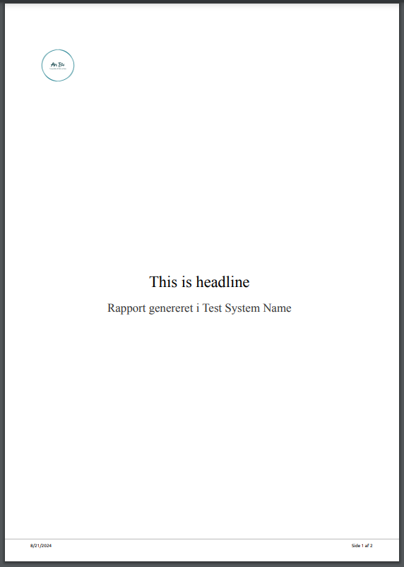

# PDF Service: Handling Front Page Configuration

When configuring the PDF service, setting the `AutoGenFrontPage` property to `true` requires additional fields to be specified. These fields ensure that the front page of the generated PDF is properly populated.

## Required Fields

If `AutoGenFrontPage` is set to `true`, you must provide values for the following fields:

- **`SystemName`**: Indicates the name of the system or application generating the document.
- **`Logo`**: Can be either a URL or a base64-encoded image. This will be used as the logo on the front page.
- **`Headline`**: Defines the main headline to be displayed on the front page.

## Request and Result Example

### Request

Ensure that your request includes values for `SystemName`, `Logo`, and `Headline` when `AutoGenFrontPage` is set to `true`. Here is an example of how the request might look:

```json
{
  "AutoGenFrontPage": true,
  "SystemName": "My Application",
  "Logo": "https://example.com/logo.png", // or base64-encoded string
  "Headline": "Welcome to My Report"
}
```

## Result
The result will be a PDF that includes the specified SystemName, Logo, and Headline on the front page. The front page will be generated based on the provided values.


## Note
Logo: The Logo field can accept either a URL pointing to an image or a base64-encoded image string. Ensure the image format is supported and correctly encoded if using base64.