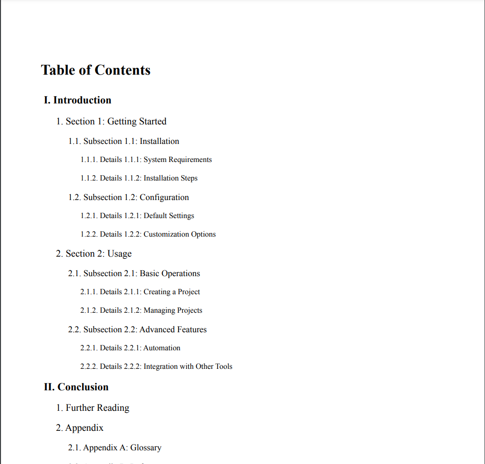

# How to Use the TOC Generation
This guide will help you integrate and use the Table of Contents (TOC) generation script in your html template.

## Prerequisites
- Html template: [here](../tocTemplate.html)
- Basic HTML knowledge: You should know how to add HTML elements to your pages.

###  Add the TOC Container to Your Page

In the `.html` file where you want to display the Table of Contents, add a `div` element with the `id="toc"`:
```
<div id="toc"></div>
```
This div will act as the container for your automatically generated TOC.

### Add Headers with TOC Classes
In your `.html` file, use `div` elements with specific classes to define the sections of your content. The classes `.toc-1`, `.toc-2`, `.toc-3`, and `.toc-4` represent different levels in the TOC hierarchy:
```
<div class="toc-1">Introduction</div>
<p>This is the introduction section.</p>

<div class="toc-2">Section 1</div>
<p>This is the first section.</p>

<div class="toc-3">Subsection 1.1</div>
<p>This is the first subsection.</p>

<div class="toc-4">Details 1.1.1</div>
<p>This is the details of subsection 1.1.</p>
```

### Result


## Conclusion
By following these steps, you can easily add a dynamically generated Table of Contents to any page in your application. The TOC will be automatically generated based on the content of your page, helping users navigate your documentation or articles more easily.
